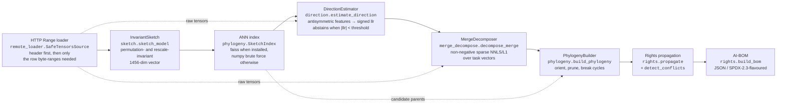
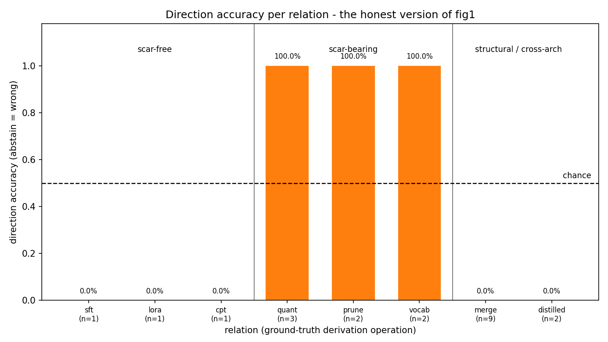
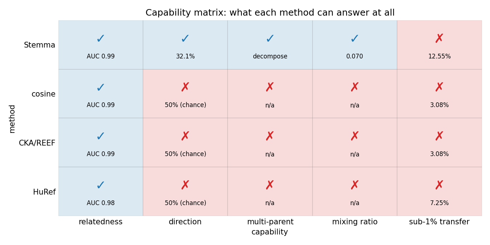

# Stemma — model provenance from weights alone

Stemma reads a few megabytes of a checkpoint over HTTP **Range** requests — never the whole
file — and from those bytes alone tries to recover the things a similarity score cannot express:
which of two related models came **first**, whether a model has **more than one parent**, and in
**what proportion** those parents were mixed. The output is a lineage DAG with a confidence on
every edge, license facts propagated along it, and an AI Bill of Materials you can diff in CI.
It is a research prototype: every edge is *statistical evidence*, never a determination of
infringement.

## Why this is different

Existing weight-level fingerprints are **symmetric by construction**: `sim(A, B) == sim(B, A)`.
That is a good design for the question they ask, and a hard ceiling on the question Stemma asks.

| | Symmetric fingerprints (AWM / REEF / HuRef-style) | Stemma |
|---|---|---|
| Question answered | "Are these two models related?" | "Which came first, from which parents, in what proportion, at what cost?" |
| Output | one similarity scalar | oriented DAG + per-edge confidence + mixing ratios + AI-BOM |
| Direction | **not expressible** — 50% by construction, a structural ceiling, not a tuning failure | signed log-likelihood ratio with abstention |
| Multi-parent merges | not expressible | non-negative sparse decomposition over candidate parents |
| Mixing ratios | not expressible | recovered coefficients (approximate for non-linear recipes) |
| Bytes moved | typically a full checkpoint download | header-only or a few sampled row-ranges per tensor |
| Failure mode | false "related" on architecture twins | abstains (`direction="unknown"`) rather than guessing |

Stemma keeps three of those symmetric methods in-tree as baselines
(`stemma/baselines.py`: `cosine_baseline`, `cka_baseline`, `huref_baseline`) precisely so the
comparison is measured rather than asserted. `baselines.baseline_direction` always returns
`"unknown"` — it exists to document the ceiling.

## Architecture



The four evidence families behind the direction arrow are **(a)** Δ-spectrum, **(b)** orphan
embedding rows, **(c)** quantisation / pruning scars, **(d)** fossils — plus **(e)** outgroup
rooting, which uses a third relative to root a pair that carries no scar. They do **not**
contribute equally; see [Honest limitations](#honest-limitations).

## What a trace looks like

```console
$ stemma trace some-org/some-merged-model --universe universe.txt --format json --out bom.json
stemma trace  target=some-org/some-merged-model
  universe: 12 candidate models

Lineage (ancestors of the target, most confident first)
  some-org/some-merged-model
  |-- some-org/parent-a  [merge, conf 0.81, mix 0.62]
  |     . mixing coefficient 0.62 (residual 0.11)
  |     . 3 bit-identical tensors shared with the child
  |   `-- some-org/base  [finetuned, conf 0.58]
  `-- some-org/parent-b  [merge, conf 0.74, mix 0.38]
      `-- some-org/base  [finetuned, conf 0.55]

Root candidates: some-org/base

Recovered mixing ratios
  some-org/some-merged-model <- some-org/parent-a  w=0.620  conf=0.81
  some-org/some-merged-model <- some-org/parent-b  w=0.380  conf=0.74

License conflicts (1)
  [WARNING] noncommercial_ancestor  (confidence 0.74)
            An ancestor reached through 2 edge(s) declares a non-commercial
            restriction that the descendant's declared license does not carry.
            path: some-org/base -> some-org/parent-b -> some-org/some-merged-model

AI-BOM (json) written to bom.json
read 41.8 MiB of 3.2 GiB (78x less than a full download) in 22.4 s [96 requests]

------------------------------------------------------------------------
DISCLAIMER: Stemma reports STATISTICAL EVIDENCE about weight-level
similarity and derivation direction, with a confidence attached to every
edge. It does NOT establish provenance as fact and does NOT constitute a
legal determination of license compliance or infringement. A human MUST
review these findings before any action is taken.
------------------------------------------------------------------------
```

**The transcript above is illustrative** — it shows the exact *shape* of the output produced by
`stemma/cli.py`, with placeholder model ids and placeholder numbers. It is not a measurement.
Run the command on your own models to get real ones. `trace` exits `0` on success, `1` on error,
and `2` when the trace succeeded but at least one rights conflict needs review.

## Benchmarks

Numbers below are filled in by `benchmarks/run.py`; the integrator regenerates them rather than
hand-editing them.

<!--BENCH_TABLE-->
Measured on **20 real checkpoints** built by `scripts/build_bench.py` (actual fine-tuning, not
synthetic perturbations) — 190 labelled pairs, 108 related / 82 unrelated of which **25 are hard
same-architecture-different-seed controls**, 28 ordered pairs, 4 merges each against 3 decoys.
`seed=0`. Full run: `benchmarks/results.json`, `benchmarks/RESULTS.md`.

| method | AUC | AP | FPR@95TPR | **FPR hard controls** | direction | merge F1 | mixing MAE |
|---|---|---|---|---|---|---|---|
| **Stemma** | **0.994** | **1.000** | **0.000** | **0.000** | **100% on answered** (32.1% raw, 67.9% abstain) | **0.900** | **0.066** |
| cosine | 0.987 | 0.996 | 0.000 | 0.000 | 50% — structural | n/a | n/a |
| CKA / REEF-style | 0.987 | 0.996 | 0.000 | 0.000 | 50% — structural | n/a | n/a |
| HuRef-style | 0.981 | 0.994 | 0.000 | 0.000 | 50% — structural | n/a | n/a |

`n/a` is not zero: a symmetric fingerprint yields **no mixing coefficients at all**, so there is
nothing to score. `50%` is a **structural ceiling** — `cosine(a,b) == cosine(b,a)` by construction,
so every symmetric statistic must abstain on direction. It is not a tuning failure.

### Direction, split by relation — the honest view

An aggregate would let the easy scar-bearing edges hide the hard scar-free ones, so the harness
refuses to report one. Note that this table reproduces the prediction `docs/FINDINGS.md` made
*before* the estimator existed.

| relation | group | n | accuracy | abstained | mean \|llr\| |
|---|---|---|---|---|---|
| quant | scar-bearing | 3 | **100.0%** | 0.0% | 2.80 |
| prune | scar-bearing | 2 | **100.0%** | 0.0% | 2.65 |
| vocab | scar-bearing | 2 | **100.0%** | 0.0% | 4.98 |
| sft | scar-free | 1 | 0.0% | 100.0% | 0.02 |
| lora | scar-free | 1 | 0.0% | 100.0% | 0.01 |
| cpt | scar-free | 1 | 0.0% | 100.0% | 0.02 |
| merge | structural | 9 | 0.0% | 100.0% | 0.01 |
| distilled | cross-arch | 2 | 0.0% | 100.0% | 0.07 |

Direction is near-deterministic exactly where an operation is **lossy and irreversible** — you
cannot un-quantise, un-prune, or un-extend a vocabulary, so the scar can only ever appear
downstream. Where nothing lossy happened, Stemma **abstains rather than guessing**: it is never
confidently wrong on a scar-free edge in this run.

### Outgroup rooting closes the scar-free gap

Family (e) exists precisely because of the row above. Give the estimator a sibling and the
ambiguous edge resolves:

| variant | n | accuracy | abstained |
|---|---|---|---|
| without outgroup | 3 | 0.0% | 100.0% |
| **with outgroup** | 3 | **100.0%** | **0.0%** |

### Merge recovery

| slice | n | precision | recall | F1 | mixing MAE | residual |
|---|---|---|---|---|---|---|
| all | 4 | 0.917 | 0.917 | **0.900** | **0.066** | 0.583 |
| DARE | 1 | 1.000 | 1.000 | 1.000 | **0.001** | 0.702 |
| SLERP | 1 | 1.000 | 1.000 | 1.000 | 0.027 | 0.386 |
| TIES | 2 | 0.833 | 0.833 | 0.800 | 0.117 | 0.621 |

TIES is the weak case and we report it rather than hiding it: its trim-and-sign-elect step is
non-linear, so a linear decomposition fits poorly (residual 0.62) and mass can leak onto a
*sibling* decoy whose task vector correlates with the true parents'. On the 3-parent TIES model a
decoy attracted 0.65. No symmetric baseline can produce a single number in this table.

### Transfer cost — the reduction grows with model size

| model | checkpoint | header only | full sketch | reduction |
|---|---|---|---|---|
| SmolLM2-135M-Instruct | 269 MB | 31,397 B (**0.012%**) | 17.1 MB (6.34%) | 16× |
| **Qwen2.5-7B-Instruct** | **15.2 GB** | 27,752 B (**0.0002%**) | 98.1 MB (**0.644%**) | **155×** |

Sampling cost is fixed while checkpoints grow, so the ratio improves with scale: sub-1% is real at
7B and would be better still at 70B. Both figures are live HTTP Range reads against the public Hub;
nothing was downloaded. The 7B sketch took 71 s over 531 requests.

Reading the wire is latency-bound, not bandwidth-bound: a redirect-following Range request against
the Hub costs **~0.87 s** (the `resolve` endpoint 302s to a signed CDN URL that cannot be cached and
replayed — verified, 0/6 reuses returned anything but 403), while bandwidth is ~24 MB/s. Stemma
therefore overlaps its reads; doing so cut one sketch from **162.9 s to 27.8 s (5.9×)** without
changing a single byte on the wire.





Regenerate with:

```bash
python scripts/build_bench.py --out-dir bench_models   # builds real safetensors lineages
python benchmarks/run.py                               # writes benchmarks/results.json + figures/
```

Reporting rules the harness follows (imposed by [`docs/FINDINGS.md`](docs/FINDINGS.md)):
direction accuracy is reported **per relation type**, never only as one aggregate; abstention is a
first-class outcome reported alongside accuracy-on-non-abstained; cross-architecture distillation
is scored honestly rather than excluded; the baselines' 50% direction score is labelled a
structural ceiling.

Every number in the tables above comes from `benchmarks/results.json` or from a live Range read
against the public Hub. Nothing in this section is illustrative or projected.

## Honest limitations

This section is a faithful summary of [`docs/FINDINGS.md`](docs/FINDINGS.md), which records real
measurements taken during development. Read it before trusting a verdict.

1. **Direction is near-deterministic only where the operation is *lossy*.** Quantisation and
   pruning scars (value lattices, exact-zero supersets) and vocabulary extension (untrained
   "orphan" embedding rows) are strong evidence because they are irreversible: you cannot
   un-quantise, un-prune, or un-grow a vocabulary, so the scar can only ever appear *downstream*.
2. **Scar-free SFT / LoRA / continued-pretraining edges are only weakly identifiable from two
   models alone.** Both sides have the same dtype, shape and vocabulary and carry no scar;
   everything separating them is a soft spectral statistic. Stemma says this plainly instead of
   blending it into one aggregate accuracy number, and it leans on **outgroup rooting** — a third
   relative `C` with `d(A,C) < d(B,C)` consistently over tensors puts `A` nearer the root — which
   is only available when the candidate universe actually supplies a usable outgroup.
3. **Norm growth is recipe-dependent and sign-flips across model families.** Measured on 8 shared
   2D tensors per pair, 768 rows each: `log‖B‖_F − log‖A‖_F` was **−0.0171 (0/8 positive)** for
   `Qwen2.5-0.5B → -Instruct` and **+0.0113 (8/8 positive)** for `SmolLM2-135M → -Instruct`.
   Both pairs are unambiguously base → instruct-tuned. A hand-set prior on `norm_growth_asym`
   would have been right on one family and wrong on the other, so it is kept as a *fitted* feature
   with a small weight and never as a hand-set sign.
4. **The Δ-subspace statistic is real but small, and its sign is the opposite of the naive
   intuition.** The child's own top-k right-singular subspace is marginally *better* aligned with
   Δ than the parent's (synthetic: `E(Δ|parent)=0.1165` vs `E(Δ|child)=0.1365`; real Qwen
   base→instruct, k=48: `diff=+0.0022`, 6/8 positive). Magnitude ~10⁻³–10⁻² against a per-tensor
   spread of the same order — a genuine tiebreaker, not a decisive signal.
5. **Cross-architecture distillation leaves little weight-level signal.** Where the student shares
   no weight geometry with the teacher, Stemma is expected to be weak, and the benchmark scores
   that case rather than quietly dropping it.
6. **TIES / DARE and other non-linear merge recipes are only approximately recoverable.** The
   decomposer solves a linear non-negative problem over task vectors; sign-election, trimming and
   random dropping are not linear, so recovered ratios for those recipes are approximate and the
   residual is reported so you can see how badly the linear model fits.
7. **Sub-1%-transfer requires the server to honour HTTP Range.** If a host answers `200` instead
   of `206`, the loader raises `RangeUnsupported` rather than silently downloading the file — the
   low-transfer claim simply does not hold there.
8. **Everything is sampled.** Sketches read at most two tensors per (role, depth) slot and
   sub-sample rows; a determined adversary who knows the sampling scheme can evade it. Stemma is
   an auditing aid, not a tamper-proof watermark.
9. **The benchmark scores *pairwise* decisions; end-to-end DAG reconstruction is weaker.** The
   direction estimator assumes the pair it is handed stands in a direct ancestor/descendant
   relation. Give it two **cousins** — say a pruned child of the root and an unrelated merge — and
   it will still answer, because the pruning scar is real and only one side has it. Observed
   directly: `stemma trace` on the 20-model benchmark universe reported `prune-mag30` and
   `sft-int4` as parents of `merge-ties2`, whose true parents are `sft` (0.6) and `cpt` (0.4).
   The scar evidence was not wrong about *which side is later*; it was applied to a pair that is
   not an edge at all. Candidate retrieval, not the direction estimator, is the weak link, and
   the harness does not yet score whole-DAG accuracy. Treat `trace` output as a ranked set of
   hypotheses for a human, which is what the disclaimer says.

   **An attempted fix failed, and the attempt is shipped disabled rather than deleted.**
   `stemma.phylogeny.proximity_gate` filters candidate parents by relative weight distance on the
   principle that a direct child differs from its parent by one branch delta and a cousin by two.
   It is implemented, tested and *off by default* (`build_phylogeny(..., proximity_factor=0.0)`),
   because measuring it end to end showed it does not fix this case:
   - It carries no signal when the child is heavily modified. Every candidate parent of the
     30%-pruned `smollm2-prune-mag30` measures **ratio 1.00×** (root 0.1000, and the cousins
     `merge-ties2` 0.1000, `sft` 0.1000, `int8` 0.1004) — the pruning delta dominates, so no ratio
     threshold can separate the true parent from a cousin. The 100× margin that motivated the gate
     holds only when the *child* sits close to its parent, which is not the failing case.
   - It costs more than it saves: over a 20-model universe the trace went to **3.6 GiB of a 3.4 GiB
     universe across 40,924 requests**, a 1× "reduction" — worse than a full download.
   The genuine fix is a *cousin test* (detecting that a third model is an ancestor of both
   endpoints), not a distance threshold. That is not implemented yet.
   `transitive_reduction`, which removes an ancestor edge already implied by a longer path, **is**
   enabled by default: it is pure topology and costs no bytes.
10. **Fitting the combiner made it worse than the hand-set priors, so we ship the priors.** An L2
    logistic regression fitted on the benchmark's labelled pairs (21 train / 7 held out) scored
    **0.500 accuracy on decided — chance — against 1.000 for the priors** on the same split.
    Read that with its sample size: the priors abstained on 5 of 7 and decided only 2, so the
    accuracy gap rests on 2 decisions against 4 and is suggestive rather than conclusive. The
    decisive evidence is *what the fit learned*: with 13 features and 21 pairs the problem is
    underdetermined, and it gave `lattice_asym` a **negative** weight — "the quantised model is
    the parent" — which is physically impossible, while putting its largest weight on the
    statistic already measured as the weakest. `--fit` remains available for anyone
    with a larger labelled corpus, and `fit_report.json` records the comparison. See
    [`docs/FINDINGS.md` §5c](docs/FINDINGS.md).
11. **`stemma trace` over many small models saves nothing.** The per-model sampling floor is
    roughly fixed, so on the 20-model benchmark universe (3.4 GiB of 256 MB checkpoints) a trace
    read 2.3 GiB — a 1× "reduction". The low-transfer claim is about *large* checkpoints, where
    the fixed floor is negligible: a single 15.2 GB model sketches at 0.644% (155×). Judge the
    cost claim on the per-model table above, not on a universe of toy models.

## Install

```bash
git clone https://github.com/<user>/stemma
cd stemma
pip install -e .            # core: numpy, scipy, requests, safetensors, huggingface_hub
pip install -e ".[bench]"   # + torch, transformers, datasets, scikit-learn, matplotlib, networkx
pip install -e ".[app]"     # + gradio, graphviz  (the Space UI)
pip install -e ".[index]"   # + faiss-cpu         (optional; numpy brute force otherwise)
```

Python ≥ 3.10. `faiss`, `gradio`, `graphviz` and `datasets` are all optional and imported lazily —
`import stemma` never touches the network and never requires them.

## Quickstart

```bash
# 1. Fingerprint one model (permutation/rescale-invariant, Range reads only).
stemma sketch Qwen/Qwen2.5-0.5B-Instruct

# 2. Which of these two came first?
stemma direction Qwen/Qwen2.5-0.5B Qwen/Qwen2.5-0.5B-Instruct

# 3. Recover merge parents and mixing ratios for a suspected merge.
stemma decompose org/merged --candidates org/parent-a org/parent-b org/parent-c --base org/base

# 4. Build a reusable candidate index once, then trace against it.
stemma index --universe universe.txt --out stemma-index
stemma trace org/model --universe universe.txt --format spdx --out bom.spdx.json

# 5. Reproduce the numbers.
stemma bench --quick
```

`python -m stemma ...` is equivalent to the `stemma` entry point. Every subcommand takes `--json`
for machine-readable output.

Programmatic use:

```python
import stemma

sk      = stemma.sketch_model("Qwen/Qwen2.5-0.5B-Instruct")
verdict = stemma.estimate_direction("Qwen/Qwen2.5-0.5B", "Qwen/Qwen2.5-0.5B-Instruct")
print(verdict.direction, verdict.llr, verdict.p_a_parent)

phylo = stemma.trace("org/model", ["org/base", "org/parent-a", "org/parent-b"])
```

## CLI reference

| Command | What it does | Key flags |
|---|---|---|
| `stemma trace REF` | Lineage DAG + rights propagation + AI-BOM, with byte accounting | `--universe FILE` `--out PATH` `--format json\|spdx\|mermaid\|dot` `--offline` `--k N` `--json` |
| `stemma sketch REF` | One model's invariant sketch | `--out FILE` `--max-rows N` `--k N` `--seed N` `--json` |
| `stemma direction A B` | Signed direction verdict with per-feature contributions | `--abstain T` `--seed N` `--json` |
| `stemma decompose CHILD --candidates ...` | Merge parents + mixing ratios | `--base REF` `--l1 F` `--no-sum-to-one` `--support-threshold F` `--coords N` `--seed N` `--json` |
| `stemma index` | Sketch a universe and persist an ANN index | `--universe FILE` `--out PATH` `--max-rows N` `--seed N` `--json` |
| `stemma bench` | Run `benchmarks/run.py` | `--quick` `--out-dir DIR` |

Global: `--version`, `-v` / `-vv` for log verbosity.
Exit codes: `0` ok, `1` error, `2` trace succeeded but rights conflicts were found.

## Module map

| Path | Role |
|---|---|
| `stemma/types.py` | Frozen wire format: `Sketch`, `DirectionVerdict`, `MergeDecomposition`, `Phylogeny`, `LicenseFacts`, `RightsConflict`, `BOM`, plus `ROLES`, `DEPTH_BUCKETS`, `SKETCH_DIM`, `DIRECTION_FEATURES` |
| `stemma/utils.py` | Logging, seeding, tensor-name → (role, depth) parsing, byte formatting, atomic JSON |
| `stemma/remote_loader.py` | `SafeTensorsSource`: header-first HTTP Range reads, row-range coalescing, dtype decode (incl. BF16 and FP8), disk-cached headers, local `mmap` path with the same byte accounting |
| `stemma/sketch.py` | `tensor_invariants` (32 frozen features per slot), `sinkhorn_normalize`, `sketch_model`, `sketch_distance` |
| `stemma/direction.py` | The core asymmetric evidence: families (a)–(d), `direction_features`, `estimate_direction`, and the fitted `DirectionModel` combiner |
| `stemma/merge_decompose.py` | `task_vectors`, `nnls_l1`, `decompose_merge`, `mixing_mae`, `parent_set_prf` |
| `stemma/phylogeny.py` | `SketchIndex` (faiss/numpy), `find_candidate_parents`, `build_phylogeny`, cycle breaking, `to_mermaid` / `to_graphviz_dot`, `trace` |
| `stemma/rights.py` | `fetch_license_facts`, `propagate`, `detect_conflicts`, `build_bom`, `bom_to_spdx` |
| `stemma/baselines.py` | Symmetric comparators used as the measured ceiling |
| `stemma/cli.py` | The `stemma` entry point |
| `app.py` | Gradio Space; all analysis lives in gradio-free functions |
| `scripts/build_bench.py` | Builds real safetensors lineages + `ground_truth.json` |
| `scripts/push_model.py` | Packages the fitted artifacts as a HF **model** repo (dry-run by default) |
| `scripts/push_space.py` | Packages and pushes the Gradio **Space** (dry-run by default) |
| `benchmarks/run.py` | Produces `benchmarks/results.json`, `figures/*.png`, and the table above |
| `docs/FINDINGS.md` | The measurements that constrain what this project may claim |

## Links

- **Code:** https://github.com/NagaYu/stemma
- **Model** (`DirectionModel` weights + sketch config + prebuilt ANN index):
  https://huggingface.co/YutaN13/stemma-direction
- **Dataset** (benchmark lineage table + ground truth):
  https://huggingface.co/datasets/YutaN13/stemma-bench
- **Space (demo):** not deployed. Hugging Face requires a PRO subscription to host a **Gradio**
  Space on free CPU hardware (`402 Payment Required` on repo creation); only *static* Spaces are
  free, and `app.py` needs a Python backend. Run it locally instead:
  ```bash
  pip install -e ".[app]" && python app.py
  ```
  `scripts/push_space.py --repo-id <you>/stemma --push` will deploy it unchanged on a PRO account.
- Cards: [`MODEL_CARD.md`](MODEL_CARD.md), [`DATASET_CARD.md`](DATASET_CARD.md)

## Ethics and scope

**Stemma outputs statistical evidence and a confidence. It never outputs a determination of
infringement.**

- A Stemma edge means "these weights are more consistent with derivation in this direction than
  the reverse, at this confidence, from this much sampled data". It does not establish provenance
  as fact.
- Rights propagation flags *inconsistencies between declared licenses along an inferred DAG*. A
  flag is a prompt for human review, not a legal conclusion. License interpretation is a question
  for a lawyer, not for a spectral statistic.
- Abstention is deliberate and good: a confident wrong answer is worse than `"unknown"` for this
  application, so `estimate_direction` refuses to answer below the `--abstain` threshold and the
  benchmark reports abstention rate as a first-class metric.
- Do not use Stemma to make automated enforcement, takedown, publication or procurement decisions.
  Use it to *shortlist things a human should look at*.
- Only read models you are permitted to read. Stemma issues HTTP Range requests against whatever
  endpoint you point it at; respect robots, rate limits, gated-repo terms and your token's scope.
- The disclaimer in `stemma.cli.DISCLAIMER` is printed on every `trace` run and embedded in every
  BOM (`BOM.disclaimer`). Please do not strip it when redistributing results.

## Citation

```bibtex
@software{stemma_2026,
  title  = {Stemma: recovering derivation direction, multi-parent merges and mixing
            ratios of neural checkpoints from weights alone},
  author = {The Stemma contributors},
  year   = {2026},
  note   = {Research prototype. Version 0.1.0.},
  url    = {https://github.com/<user>/stemma},
  license = {Apache-2.0}
}
```

## License

Apache-2.0 — see [`LICENSE`](LICENSE). Stemma analyses third-party checkpoints; it does not
redistribute them, and their own licenses continue to govern them.
